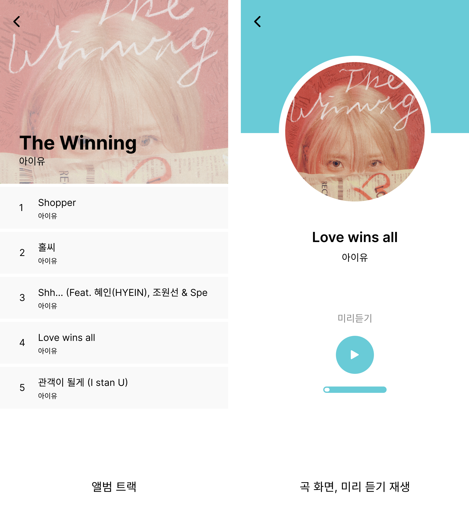

<h1>MusicLife MULA</h1>

🔗 배포 URL : <a href='https://musiclife-mula.netlify.app/'>MULA</a>

<br/>
<br/>

🔒테스트 계정🔒<br/>
ID : rhksflwk2024@gmail.com<br/>
PW : test1234~~<br/>

<br/>
<br/>
일상에서 음악을 뗄 수 없을 만큼 좋아하는 마음에서 소소하게 시작해 본 프로젝트입니다<br/>
스포티파이의 API를 통해 음악을 탐색하고 즐길 수 있도록 도와줍니다<br/>
주로 모바일을 통해 음악을 듣기 때문에 모바일 버전으로 만들었으며, 이 어플을 사용하기 위해서는 스포티파이 계정이 필요합니다

<br/>
<br/>

# 목차

[1. 구현 내용](#구현-내용)

[2. 실행](#실행)

[3. 기술 스택](#기술-스택)

[4. 스크린샷](#스크린샷)

[5. 프로젝트 구조](#프로젝트-구조)

<br/>
<br/>

# 구현 내용

- 스포티파이 API와 axios를 활용하여 아티스트 정보 및 곡 정보를 받아옵니다

- react-router-dom과 useNavigate를 통해 페이지를 이동합니다

- useContext, sessionStorage, localStorage를 통해 데이터를 관리합니다

- 재접속 시 로그인 상태를 초기화하기 위해 로그인에 사용되는 토큰을 sessionStorage에 저장합니다

- ReactHooks를 활용하여 무분별한 리렌더링 방지, 데이터의 변화를 저장 및 변경, 현재 데이터의 상태를 파악합니다

- 로그인, 로그아웃

  - 로그인 여부에 따른 초기 화면<br/>
    로그인❌ → 로그인 안내<br/>
    로그인⭕ → 검색창과 추천 플레이리스트<br/><br/>
  - 자동 로그아웃<br/>
    스포티파이 API는 로그인 후 1시간이 경과하면 해당 토큰을 사용할 수 없습니다<br/>
    때문에 사용자가 예고 없이 어플을 사용할 수 없는 상황이 발생합니다<br/>
    이를 해결하기 위해 로그인 후 1시간이 경과하면 자동으로 로그아웃 되도록 설정했습니다<br/>
    <i>( sessionStorage와 localStorage 초기화 → 자동 로그아웃 alert 창 표시 → 초기 화면으로 이동 )</i>

- text가 길어져 해당 공간을 넘어가면 text가 옆으로 흘러갑니다

- 아티스트 검색 : 아티스트 이름을 검색하여 찾을 수 있습니다

- 아티스트 정보 : 아티스트 이미지, 팔로워 수, 장르를 확인할 수 있습니다

- 인기 트랙 및 앨범 : 아티스트의 인기 트랙과 앨범을 확인할 수 있습니다

- 앨범 트랙리스트 : 앨범의 트랙 리스트를 확인할 수 있습니다

- 음악 미리 듣기 : 음악 페이지에서 30초 미리 듣기가 가능합니다

- 음악 추가/삭제 : 음악 페이지에서 원하는 곡을 플레이리스트에 추가하고, 플레이리스트 페이지에서 원하는 곡을 삭제할 수 있습니다

- sweetalert2를 통한 alert 창 구현

<br/>
<br/>

# 실행

필수조건 : `Node.js` , `npm` or `yarn`

<br/>

```bash
$ git clone https://github.com/may-jan/MusicLife_MULA.git
```

```bash
$ npm install   or  $ yarn install
```

```bash
$ npm start   or   $ yarn start
```

<br/>
<br/>

# 기술 스택


<br/>


<br/><br/>

<br/>
<br/>

# 스크린샷

<div align='center'>

<br/>
<br/>
<br/>


<br/>
<br/>
<br/>


<br/>
<br/>
<br/>


<br/>

<p>text가 공간을 넘치는 경우 흐르는 형태</p>
</div>

<br/>
<br/>

# 프로젝트 구조

<div align='center'>

</div>

<br/>
<br/>
